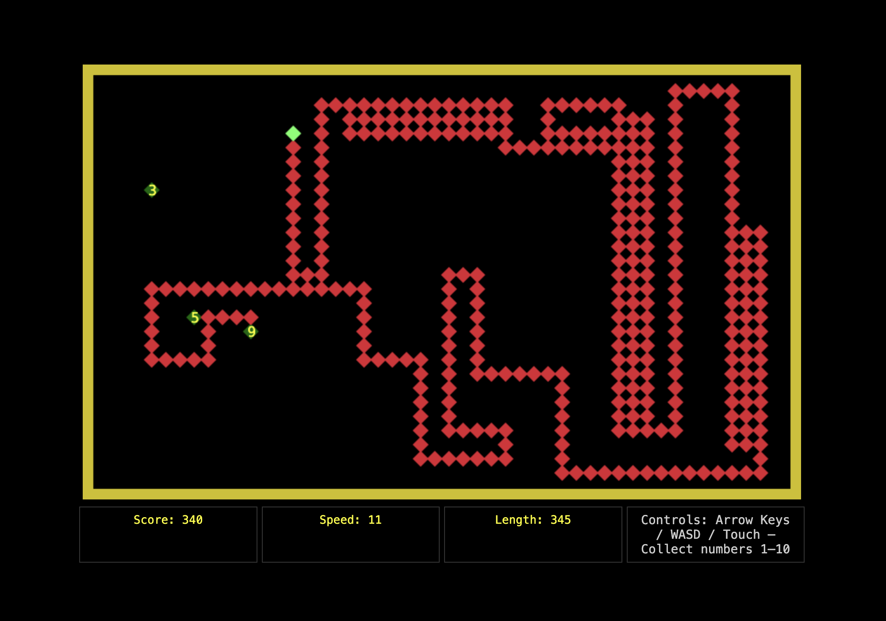

# Worm Game

A classic snake-style game built with vanilla JavaScript where you control a worm to collect numbered items on the screen.

## How to Play

- **Objective**: Direct the worm to collect numbers that appear on the screen (1-10)
- **Scoring**: Each number collected adds to your score equal to its value
- **Growth**: The worm's tail grows by the same amount as the number collected
- **Challenge**: As the tail gets longer, avoid running into your own tail or the walls
- **Game Over**: Collision with tail or walls ends the game

## Controls

- **Desktop**: Arrow keys or WASD
- **Mobile**: Swipe gestures
- **Pause**: Spacebar (desktop only)

## Features

- Responsive design that works on both desktop and mobile
- Progressive difficulty - speed increases every 20 points
- Real-time HUD showing score, speed, and worm length
- Touch-friendly mobile interface
- Retro-style graphics with diamond-shaped segments

## Getting Started

1. Clone or download this repository
2. Open `index.html` in your web browser
3. Click "Start Game" and begin collecting numbers!

## Technical Details

- Built with vanilla JavaScript (ES6+)
- HTML5 Canvas for rendering
- CSS3 for responsive styling
- No external dependencies

The game uses a grid-based movement system with collision detection and implements classic snake game mechanics with the twist of numbered collectibles that affect both score and growth rate.